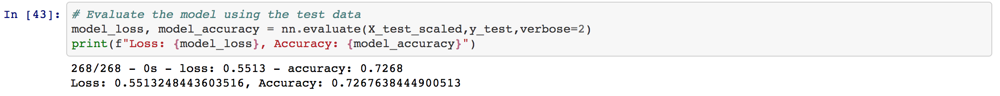

# Neural Network and Deep Learning Models

## Overview of Project

The purpose of this project is to explore and implement neural networks using the TensorFlow platform in Python.

The steps to do the task:
* Preprocessing Data for a Neural Network Model
* Compile, Train, and Evaluate the Model
* Optimize the Model

## Resources:
* Data sources: charity_data.csv

## Tools
* Python
* scikit-learn, TensorFlow, Keras 
* Jupyter Notebook

## Result

### Data Preprocessing
* The target variable that was considered for this model: IS_SUCCESSFUL columns.
* Variable(s) were considered to be the features for this model: every columns except IS_SUCCESSFUL column which was dropped.
* Variable(s) were neither targets nor features, and should be removed from the input data: EIN and NAME column.

### Compiling, Training, and Evaluating the Model
* The number of neurons, layers, and activation functions I selected for my neural network model were:
* There were 2 hidden layers with 80 neurons on first layer and 30 neurons on second layer.
* There were also an output layer.
* The first and second hidden layers had relu activation functions, and the output layer had sigmoid.

I wasn’t able to achieve 75% target model performance. The accuracy of my model was 73%.

#### Steps I took to try and increase model performance:
##### First attempt:
Removed one more features which is AFFILIATION column, updated the number of neuron for both hidden layer to 90 and 60. With this attempt, the accuracy went down to 66%.

##### Second attempt:
* Adding more neurons to a hidden layer and additional hidden layers.
* First hidden layer = 100
* Second hidden layer = 66
* Third hidden layer = 44

The accuracy for the second attempt remained the same as the first attempt.

##### Third attempt:
Using different activation functions for output layers: tanh, with first hidden layer: 100 neurons and second hidden layer: 66 neurons.
The accuracy also showed about 66%.

## Summary

Based on the optimization, the accuracy ended up with 66%. The initial neural network had 73% accuracy. For future consideration, maybe we can add more data to the dataset or remove additional features for optimization.

